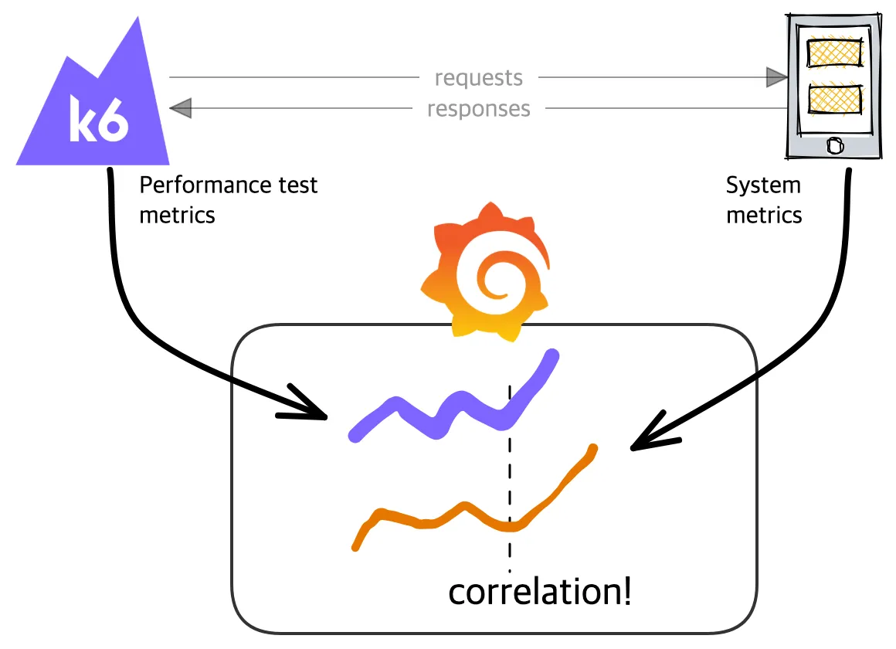
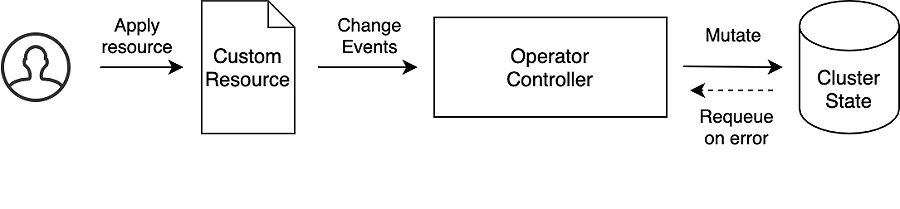
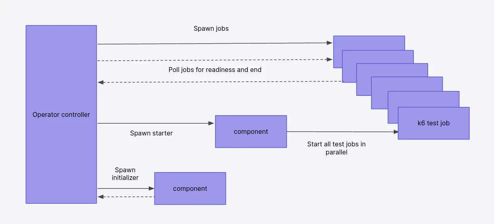
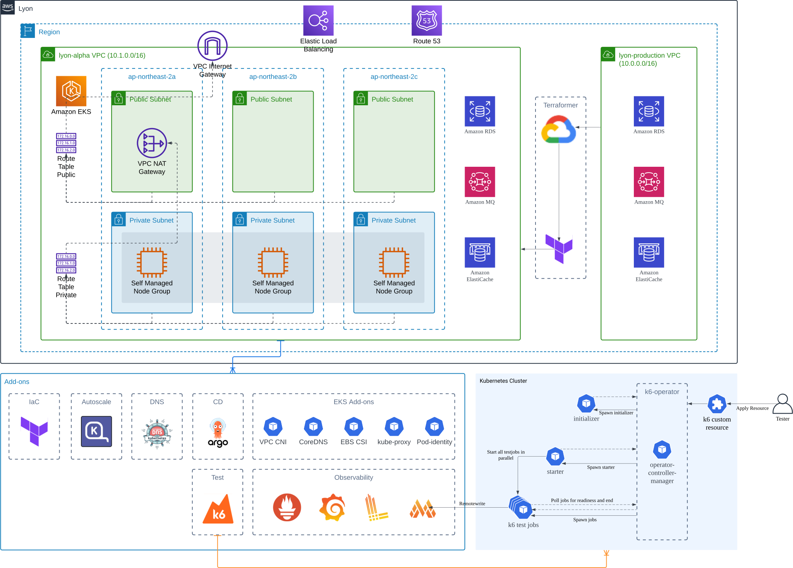
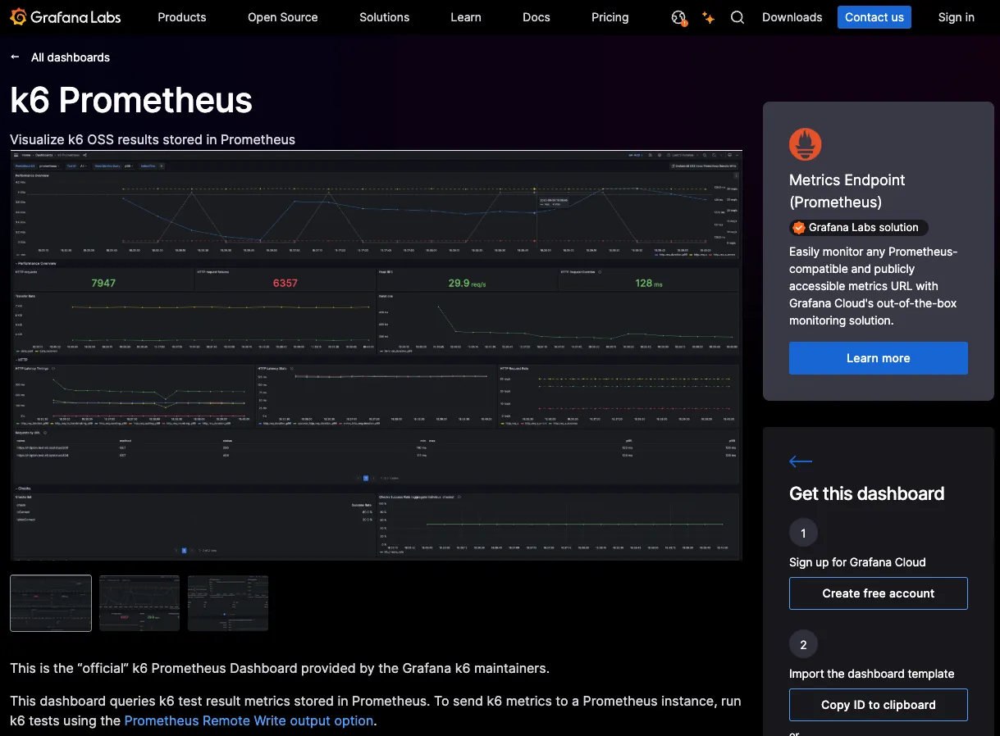

## Grafana k6 정의 (Definition of Grafana k6)

[Grafana k6](https://grafana.com/docs/k6/latest/)는 개발자 친화적이고 확장 가능한 오픈 소스 부하 테스트 도구입니다. 이 도구는 성능 문제를 사전에 예방하고 신뢰성을 향상시키기 위해 필요한 다양한 기능들을 제공합니다.

## Grafana k6의 주요 특징 (Key Features of Grafana k6)

[Grafana k6](https://grafana.com/docs/k6/latest/)는 성능 테스트와 로드 테스트를 위한 오픈 소스 도구로, 애플리케이션과 시스템의 성능을 평가하고 개선할 수 있도록 설계되었습니다. 이 도구는 특히 개발자 친화적이며, 다양한 기능을 통해 성능 최적화를 지원합니다. 아래에서는 [Grafana k6](https://grafana.com/docs/k6/latest/)의 주요 특징을 살펴보겠습니다.

1. **고성능 및 확장성**
    - **경량 아키텍처**: [Grafana k6](https://grafana.com/docs/k6/latest/)는 높은 부하를 효율적으로 생성할 수 있도록 설계되어, 대규모 부하 테스트를 단일 인스턴스에서도 실행할 수 있습니다.
    - **클라우드 및 분산 환경**: 필요에 따라 쉽게 확장할 수 있는 유연성을 제공하며, Kubernetes와 통합하여 지표 수집이 용이합니다.
2. **스크립트 기반 테스트 작성 (JavaScript / TypeScript 지원)**
    - **JavaScript / TypeScript 활용**: 테스트 스크립트를 JavaScript 및 TypeScript로 작성할 수 있어, 개발자에게 친숙한 환경을 제공합니다.
    - **복잡한 논리 구현**: 코드 기반으로 복잡한 조건과 논리를 손쉽게 구현할 수 있어, 다양한 시나리오를 테스트할 수 있습니다.
3. **실시간 성능 데이터 수집 및 분석**
    - **실시간 모니터링**: 테스트 실행 중에 실시간으로 성능 데이터를 수집하고 시각화할 수 있습니다.
    - **Grafana 대시보드 통합**: Grafana와의 통합을 통해 성능 데이터를 대시보드에서 쉽게 모니터링할 수 있어, 즉각적인 피드백을 제공합니다.
4. **다양한 프로토콜 및 엔드포인트 지원**
    - **다양한 프로토콜**: HTTP/HTTPS, WebSocket, gRPC, GraphQL 등 여러 프로토콜을 지원하여, 다양한 애플리케이션 환경에서 사용할 수 있습니다.
    - **RESTful API 및 마이크로서비스**: RESTful API 및 마이크로서비스 아키텍처 테스트에 최적화되어 있어, 현대적인 애플리케이션의 성능을 효과적으로 평가할 수 있습니다.
5. **통합 및 확장성**
    - **클라우드 통합**: Grafana, Prometheus, Mimir, NewRelic 등과 쉽게 통합할 수 있어, 클라우드 기반의 부하 테스트도 원활하게 진행할 수 있습니다.
    - **로컬 및 클라우드 테스트**: 로컬 테스트와 클라우드 기반 부하 테스트를 모두 지원하여, 다양한 테스트 환경을 제공합니다.
6. **사용자 친화적 개발 환경**
    - **명령줄 인터페이스(CLI)**: 간편하게 테스트를 실행할 수 있는 CLI를 제공하여, 빠르고 쉽게 테스트를 수행할 수 있습니다.
    - **다양한 결과 포맷**: JSON, CSV 등 다양한 포맷으로 결과를 출력할 수 있어, 데이터 분석에 유용합니다.
7. **커뮤니티 및 오픈소스 생태계**
    - **활발한 개발**: [Grafana k6](https://grafana.com/docs/k6/latest/)는 오픈 소스 프로젝트로, 지속적으로 개발 및 업데이트가 이루어지고 있어, 최신 기술을 반영합니다.
    - **풍부한 라이브러리와 플러그인**: 다양한 공식 및 비공식 라이브러리와 플러그인을 활용할 수 있어, 기능 확장이 용이합니다.

이처럼 [Grafana k6](https://grafana.com/docs/k6/latest/)는 성능 테스트를 보다 효율적이고 유연하게 수행할 수 있는 도구입니다.

## Grafana k6 Operator 패턴

Kubernetes 환경에서 [k6-operator](https://github.com/grafana/k6-operator)를 통해 동작하며, 이는 성능 테스트 인프라에서도 적극 활용되고 있습니다. [k6-operator](https://github.com/grafana/k6-operator)를 통해 테스트 인프라를 쉽게 구성하고 유지할 수 있습니다.

*k6-operator architecture*

*k6-operator pattern으로 kubernetes에서 동작하는 과정*

### 성능 테스트 인프라 아키텍처

성능 테스트는 EKS(Elastic Kubernetes Service) 및 Karpenter를 사용하여 구성되며, Terraformer를 통해 운영 환경과 동일한 세팅을 수집하여 Alpha 정보로 변환하여 비용 효율적으로 운영됩니다. LGTM 스택을 적용함으로써, 프로메테우스 부하 없이 [Grafana k6](https://grafana.com/docs/k6/latest/) 결과 메트릭을 수집할 수 있는 구조입니다.
*Performance Testing Infrastructure*

## 시나리오 및 실행자 (Scenario and Executors)

[Grafana k6](https://grafana.com/docs/k6/latest/)는 "Scenario"라는 개념을 통해 다양한 테스트 환경을 지원합니다. 이를 통해 워크로드 모델과 시나리오를 조합하여 유연하게 성능 테스트를 구성할 수 있습니다.

### Executors

- [Grafana k6](https://grafana.com/docs/k6/latest/)는 부하 테스트 목적에 맞는 다양한 Executor 옵션을 제공하여, 팀의 필요에 따라 적절한 Executor를 선택해 사용할 수 있습니다.

| NAME | DESCRIPTION |
| --- | --- |
| [Shared iterations](https://grafana.com/docs/k6/latest/using-k6/scenarios/executors/shared-iterations/) | 고정된 반복 횟수는 여러 VU간에 공유된다. |
| [Per VU iterations](https://grafana.com/docs/k6/latest/using-k6/scenarios/executors/per-vu-iterations/) | 각 UV는 정확한 수의 반복을 실행한다. |
| [Constant VUs](https://grafana.com/docs/k6/latest/using-k6/scenarios/executors/constant-vus/) | 고정된 수의 VU는 지정된 시간 동안 가능한 한 반복한다. |
| [Ramping VUs](https://grafana.com/docs/k6/latest/using-k6/scenarios/executors/ramping-vus/) | 가변 수의 VU는 다음과 같이 실행된다. 지정된 시간동안 가능한 한 반복한다. |
| [Constant arrival rate](https://grafana.com/docs/k6/latest/using-k6/scenarios/executors/constant-arrival-rate/) | 지정된 기간동안 고정된 수의 반복이 실행된다. |
| [Ramping arrival rate](https://grafana.com/docs/k6/latest/using-k6/scenarios/executors/ramping-arrival-rate/) | 가변 반복 횟수는 다음과 같다. 지정된 시간에 실행된다. |
| [Externally controlled](https://grafana.com/docs/k6/latest/using-k6/scenarios/executors/externally-controlled/) | 런타임 시 실행 제어 및 확장 k6의 REST API또는 CLI를 통해 수행 |

## Grafana k6 Metrics & Dashboard

**응답 시간, 오류율, 처리량** 등 다양한 성능 메트릭을 지원하며, 이러한 데이터는 팀이 시스템의 성능 추세를 이해하는 데 도움을 줍니다.

**Grafana k6 Default Built-in Metrics**

| METRIC | NAME | TYPE |
| --- | --- | --- |
| vus | 현재 활동 중인 가상 유저 | Gauge |
| vus_max | 가상 유저의 최대 수 | Gauge |
| iterations | 스크립트 반복 횟수 | Counter |
| iteration_duration | 반복 완료에 소요된 시간 | Trend |
| dropped_iterations | 시작되지 않은 반복 횟수 | Counter |
| data_received | 수신한 데이터 양 | Counter |
| data_sent | 전송한 데이터 양 | Counter |
| checks | 성공 체크 비율 | Rate |

**HTTP-Specific Built-in Metrics**

| METRIC | NAME | TYPE |
| --- | --- | --- |
| http_reqs | 생성된 HTTP 요청 수 | Counter |
| http_req_blocked | TCP 연결 대기 시간 | Trend |
| http_req_connecting | TCP 연결 소요 시간 | Trend |
| http_req_tls_handshaking | TLS 핸드셰이킹 소요 시간 | Trend |
| http_req_sending | 데이터 전송 소요 시간 | Trend |
| http_req_waiting | 응답 대기 시간 | Trend |
| http_req_receiving | 데이터 수신 소요 시간 | Trend |
| http_req_duration | 총 요청 처리 시간 | Trend |
| http_req_failed | 요청 실패 비율 | Rate |

[Grafana k6](https://grafana.com/docs/k6/latest/)가 제공하는 다양한 메트릭을 Grafana 대시보드에서 시각화함으로써, 성능 트렌드를 분석하고 모니터링할 수 있습니다.

[Grafana 대시보드](https://grafana.com/docs/k6/latest/results-output/grafana-dashboards/)에서 Output에 따른 기본 템플릿을 참고할 수 있으며, 추가적으로 파드 상태 및 리소스 사용량 등을 커스터마이징하여 활용할 수 있습니다.

이 도구를 통해 팀은 부하 테스트를 효과적으로 수행하고 시스템의 신뢰성을 높일 수 있습니다.